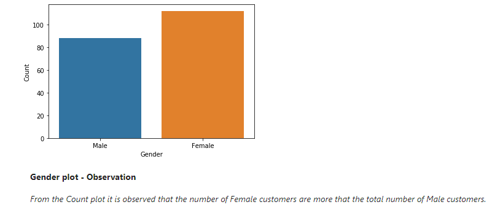
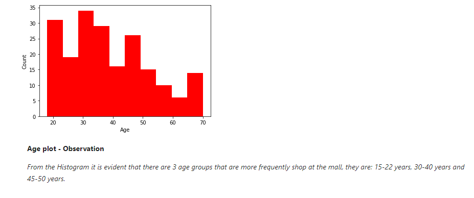
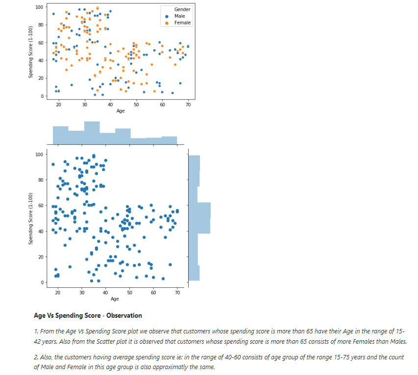
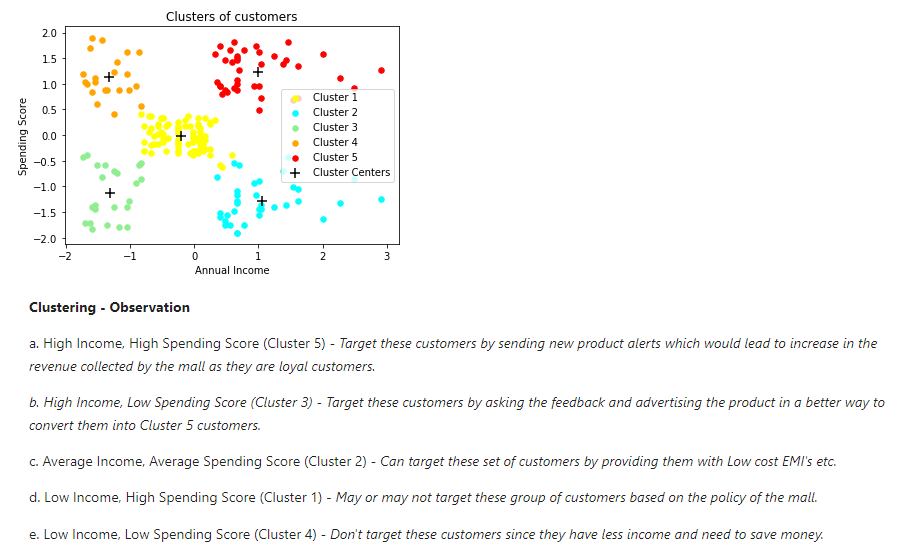

# Clustering-Mall-Customer-Segmentation

### Project Overview
This Python code demonstrates the process of analyzing customer data from a mall dataset. It performs various tasks such as loading the dataset, exploring the data, cleaning the data, visualizing the data, preprocessing the data, and building a K-means clustering model.

### Dataset 
The code uses a dataset called "Mall_Customers.csv" which contains information about mall customers. The dataset has the following columns:
* CustomerID: ID of the customer
* Gender: Gender of the customer
* Age: Age of the customer
* Annual Income (k$): Annual income of the customer in thousands of dollars
* Spending Score (1-100): Score assigned to the customer based on their spending habits and behavior

### Data Exploration
The code begins by loading the dataset using the pandas library. It then performs several operations to explore the dataset:
* Returns the number of rows and columns in the dataset using the **'shape'** attribute.
* Returns the column headers of the dataset using the **'columns'** attribute.
* Returns the datatypes of each column in the dataset using the **'dtypes'** attribute.
* Displays the first few rows of the dataset using the **'head()'** function.
* Displays the last few rows of the dataset using the **'tail()'** function.
* Provides basic information about the dataset using the **'info()'** function.
* Computes basic statistics on numeric columns using the **'describe()'** function.
* Checks if any column contains null values using the **'isnull().any()'** function.

### Data Cleaning
The code performs data cleaning operations on the dataset:
* Creates a copy of the dataset using the **'copy()'** function.
* Drops the 'CustomerID' column from the copied dataset as it does not provide any value.

### Data Visualization
The code utilizes the matplotlib and seaborn libraries to visualize the dataset:
* Visualizes the 'Gender' column using a countplot to show the distribution of genders among customers.
  
* Visualizes the 'Age' column using a histogram to show the distribution of ages among customers.
  
* Visualizes the relationship between 'Age' and 'Spending Score (1-100)' using a scatterplot and jointplot.
  

### Data Preprocessing
The code performs data preprocessing tasks:
* Selects the 'Annual Income' and 'Spending Score' columns as features for clustering.

### Model Building
The code builds a K-means clustering model to cluster customers based on their annual income and spending score:
* Trains a K-means model with a specified number of clusters using the KMeans class from the sklearn.cluster module.
* Predicts the cluster labels for the data points using the **'fit_predict()'** method.
* Visualizes the clusters by plotting the data points and cluster centers using scatterplots.

### Clustering
The code provides observations and insights from the clustering results:
* Analyzes the characteristics of each cluster based on the customers' income and spending score.
* Suggests targeted strategies for each cluster to maximize revenue and improve customer satisfaction.


### Install Packages
```
pip install pandas
pip install numpy
pip install matplotlib
pip install seaborn
pip install scikit-learn
```
